```{r setup, include=FALSE}
options(htmltools.dir.version = FALSE)
knitr::opts_chunk$set(
  fig.width=9, fig.height=3.5, fig.retina=3,
  out.width = "100%",
  cache = FALSE,
  echo = FALSE,
  message = FALSE, 
  warning = FALSE,
  hiline = TRUE
)
```

```{r eval=FALSE}
# install.packages("renderthis")
```


```{r xaringan-themer, include=FALSE, warning=FALSE}
library(xaringanthemer)
style_duo_accent(
  primary_color = "#992A38",
  secondary_color = "#DDDDDD",
  inverse_header_color = "#FFFFFF"
)
style_mono_accent(
  base_color = "#992A38",
  header_font_google = google_font("Josefin Sans"),
  text_font_google   = google_font("Montserrat", "300", "300i"),
  code_font_google   = google_font("Fira Mono")
)
#style_mono_accent(text_color = "#FFFFFF")
```
class: title-slide, inverse, no-action, center, middle
background-position: bottom
background-size: cover


```{r xaringan-Extra, include=FALSE, echo=FALSE}
# remotes::install_github("gadenbuie/xaringanExtra")
xaringanExtra::use_xaringan_extra(c("tile_view", "animate_css","use_progress_bar"))
```

```{r xaringan-tachyons, echo=FALSE}
xaringanExtra::use_tachyons()
```

```{r xaringanExtra, echo = FALSE}
xaringanExtra::use_progress_bar(color = "#DDDDDD", location = "bottom", height = "10px")
```

# `r toupper(rmarkdown::metadata$title)`
----
### `r rmarkdown::metadata$author` 
## `r rmarkdown::metadata$institute`
<div>
  
  
</div>


### `r rmarkdown::metadata$subtitle` - Grau de Treball Social 
##### `r rmarkdown::metadata$date`

  
```{r echo=FALSE}
# .tomato5.bg-white[[bit.ly/DIPUBCN](bit.ly/DIPUBCN)]
```


---
name: Servei
class:inverse, left, top, hide-logo


## Servei de Convivència, Diversitat i Cicle de Vida [](https://www.diba.cat/es/web/convivencia)
------------

Àrea d’Igualtat i Sostenibilitat Social, promou polítiques públiques adreçades a:  

* Garantir la igualtat i l’equitat.  

* Lluitar contra la discriminació.  

* Promoure la inclusió i evitar l’exclusió social.  

* Reconèixer la diversitat.  

* Promoure la convivència i el dret a la ciutat.  

* Aportar l’enfocament interseccional a les polítiques públiques.

--

Acompanyament als ens locals de la província de Barcelona a través de *suport econòmic*, *tècnic*, de *formació* i *sensibilització*.


???

---
name: WHOIAM
class: inverse, middle, center, hide-logo


# `r fontawesome::fa("quote-left", a11y = "sem", fill = "#FFFFFF")` Eloi Mayordomo
-----
<p style="text-align: left;">
<big><u>FORMACIÓ</big></u>  <br>
- Llicenciat en Ciències polítiques i de l'Administració (UPF).<br> 
- Màster en polítiques locals i participació (UAB).<br>
- Analista de de dades per la gestió pública (UB).<br>
</p>

<p style="text-align: left;">
<big><u>EXPERIÈNCIA</big></u></b>
<br>
- Consultor àmbit privat en polítiques públiques participatives (2005 - 2010) <br>
- Tècnic en serveis socials i infància en risc social - Diputació de Barcelona (2011-2021) <br>
- Tècnic de la Unitat de Cicle de Vida del Servei de Convivència, Diversitat i Cicle de Vida - Diputació de Barcelona (2022 ~ ..). </a></u></b>
</p>  

<b>·</b> 
[`r fontawesome::fa("envelope", a11y = "sem", fill = "#FFFFFF")` ](mailto:mayordomome@diba.cat)<b>·</b> 
[`r fontawesome::fa("laptop", a11y = "sem", fill = "#FFFFFF")` ](https://eloimm.github.io/)<b>·</b> 
[`r fontawesome::fa("twitter", a11y = "sem", fill = "#FFFFFF")` ](https://twitter.com/eloimm) <b>·</b>
[`r fontawesome::fa("mastodon", a11y = "sem", fill = "#FFFFFF")` ](mastodont.cat/@eloimm) <b>·</b>

???
---
name: index
class: left, top
# Índex de la presentació
-----
.pull-left[
**[I PART: Les polítiques socials](#analitic)**
* [L'Estat del benestar](#analitic2)
* [Les políques socials](#analitic3)
* [La intervenció social "_vosaltres_"](#analitic10)

**[II PART: Les polítiques d'infància.](#infancia)**
* [5 arguments a favor de les polítiques d'infància.](#arguments)
* [Context legal de la intervenció a Catalunya](#LDOIA)
* [Procès d'intervenció](#intervencio)

**[III PART: Els suport de la Unitat del Cicle de Vida](#vida)**
* [Eines per a la planificació de les polítiques d'infància i adolescència](#PLIAS)
* [Finançament per a la promoció i prevenció en l’àmbit de la infància i l’adolescència](#finançament)
* [Càlcul inversió en la infància i l'adolescència](#càlcul)

**[PART FINAL: Intercanvi visions.](#debat)**
]

--
.pull-right[
<br><br><br><br>

]
---
name: analitic
background-position: 150% 150%
class: inverse, middle, center, animated bounceInDown
# L'Estat del Benestar <br> .pq[(perquè / funció(ns)?)]
<style>
.pq{font-size: .5em;}
</style>


---
name: analitic2
background-position: 150% 150%
class: top, center, animated bounceInDown
```{r xaringan-animate-css, echo=FALSE}
xaringanExtra::use_animate_css()
```
# L'Estat del Benestar .pq[(perquè / funció(ns)?)]
.left[**Provisió del benestar**]  
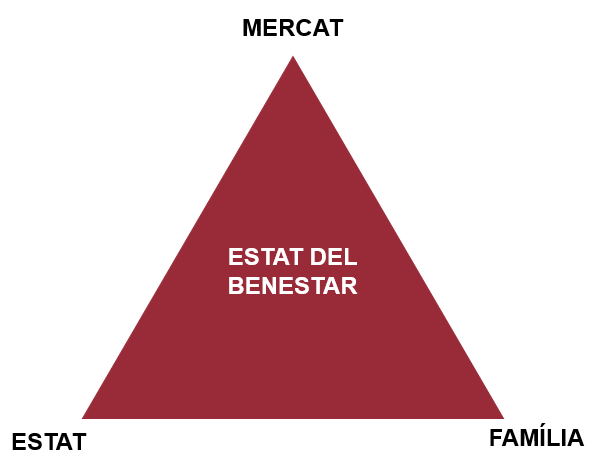

---
name: analitic3
background-position: 150% 150%
class: inverse, middle, center

# Les polítiques socials<br> .pq[(perquè / funció(ns)?)]


---
name: analitic4
background-position: 100% 100%
class: middle, center, animated bounceInDown
# Les polítiques socials .pq[(perquè / funció(ns)?)]

---
name: analitic5
background-position: 100% 100%
class: middle, center, animated flash
# Les polítiques socials .pq[(perquè / funció(ns)?)]

---
name: analitic6
background-position: 100% 100%
class: middle, center, animated bounceInDown
# Les polítiques socials .pq[(perquè / funció(ns)?)]
.pull-left[

]

---
name: analitic7
background-position: 100% 100%
class: middle, center, animated flash 
# Les polítiques socials .pq[(perquè / funció(ns)?)]

.pull-right[

]

---
name: analitic8
class: top, left, hide-logo
# Les polítiques socials .pq[(perquè / funció(ns)?)]
.pull-left[
<p align="center">
   
</p>
  
[Gösta Esping Andersen](https://producciocientifica.upf.edu/CawDOS/jsf/seleccionActividades/seleccionActividades.jsf?id=98bd45076125b1a9&idioma=ca&tipo=activ&elmeucv=N) diverses tipologies d'Estat del Benestar:  

<p style="text-align: left;">
  <ul>
    <li>Liberal</li>
    <li>Conservador</li>
    <li>Social-Demòcrata</li> 
  </ul>
</p>
<p style="text-align: left;">
  <ul>
    <li><b>(+)</b> Mediterrani o familiarista</li>
  </ul>
</p>
]
--
.pull-right[
**El trilema de l’economia dels serveis**
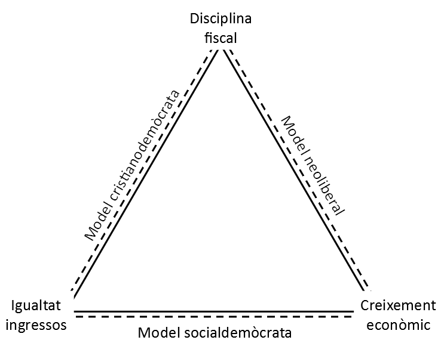
Adaptació d'[Iversen, T. i Anne Wren. 1998: 514](https://www.cambridge.org/core/journals/world-politics/article/abs/equality-employment-and-budgetary-restraint-the-trilemma-of-the-service-economy/66231805D085850B2D5ABB4B8010A542)
]
---
name: analitic9
class: top, left, 
# Les polítiques socials .pq[(perquè / funció(ns)?)]

.pull-left[
<br><br><br><br><br><br>
**Paradigma de la «inversió social»** o de la «inversió en capital humà» [(European Commission 2013b)](https://eur-lex.europa.eu/LexUriServ/LexUriServ.do?uri=COM:2013:0083:FIN:ES:PDF) <br><br>
Garantir **l'equitat de partida** i **desenvolupar les potencialitats de la ciutadania**  
]

--
.pull-right[  
**IMPLICACIONS:**  
- **«Igualtat d’oportunitats»** + **«l’activació»** ➡ anul·len el conflicte d’interessos entre classes evitant la "paradoxa de la redistribució" ([Korpi i Palme (1998)](https://www.jstor.org/stable/2657333)). 

- **Individualització**: incidir sobre les conductes, les motivacions i les actituds dels individus.  

- **Treball com a mecanisme per a la participació i l’autonomia social i econòmica**  

- **Principi de contractualització**: del contracte social ➡ compromís individual/moral.    

<style>
.center {
  width: 100%;
  text-align: center;
}

.paragraf{
  font-size: 1em;
  color: #FFFFFF;
  background: #992A38;
  font-weight: bold;
}
</style>

<div class="center">
  <p class="paragraf">La política social és un factor productiu més?<br>Validesa empírica de l’ascens social meritocràtic?</p>
</div>
</div>
]
???
---
name: analitic10
background-position: 150% 150%
class: inverse, middle, center

# La intervenció social "*vosaltres*" <br> .pq[(perquè / funció(ns)?)]

---
name: analitic11
class: top, center, animated bounceInDown
# La intervenció social "*vosaltres*" .pq[(perquè / funció(ns)?)]


---
name: analitic12
class: top, center, animated bounceInDown
# La intervenció social "*vosaltres*" .pq[(perquè / funció(ns)?)]
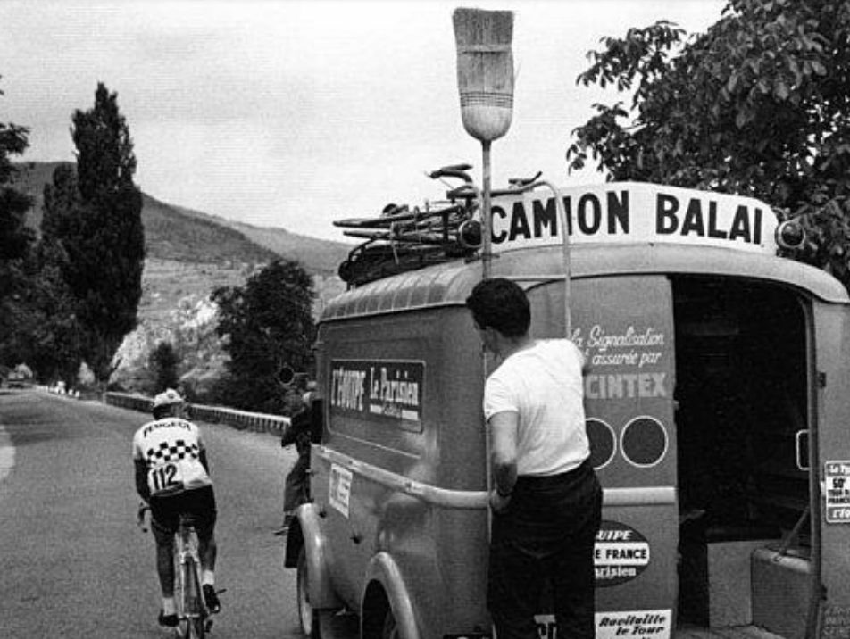

---
name: analitic13
background-position: 150% 150%
class: inverse, middle, center
# Les polítiques d'Infància <br> .pq[(perquè / funció(ns)?)]

---
name: infancia
class: inverse, middle, left
# PART II: Les polítiques d'Infància
.pull-left[
<br><br><br><br><br><br><br>
.tomato5.bg-white[[ - 5 arguments a favor de les polítiques d'infància](#arguments)**]

.tomato5.bg-white[[ - Context legal de Catalunya.](#LDOIA)]

.tomato5.bg-white[[ - Procès d'intervenció.](#intervencio)]
]


.pull-right[
<div align="right">
  
</div>
]
 
---
name: arguments1
class: top
### 5 arguments a favor de les polítiques d'infància .left[.pq[1.Plasticitat]]
<div align="center">
<iframe width="750" height="515" src="https://www.youtube.com/embed/m_5u8-QSh6A" frameborder="0" allowfullscreen></iframe>
   </iframe>
</div>

---
name: arguments2
class: top
### 5 arguments a favor de les polítiques d'infància .left[.pq[2.Pre-distribució]]  

> Una intervención que actúa más sobre las causas que sobre las consecuencias de la desigualdad y la pobreza, una especie de acción preventiva o ex ante, frente a una redistribución que consistiría en acciones curativas o ex post, una vez las situaciones de necesidad o desventaja ya se han producido.[(Noguera, José A., 2016)](http://agendapublica.es/socialdemocracia-y-redistribucion-la-dura-realidad/)  
   
  
--

  
> La mejor política social es una política pro-activa, que pone énfasis en iniciativas de capacitación y empoderamiento individual, con el objetivo no solo en proporcionar un cojín contra situaciones de infortunio, sinó de activar cualidades que favorezcan la autonomía de los individuos y refuercen su valor en el mercado de trabajo. [(Marí-Klose, P. & Marí-Klose, M., 2015)](http://www.catdem.org/cat/downloads2/politiques-predistributives-per-al-primer-cicle-vital-0-18-anys-.-final.pdf)

---
name: arguments3
class: top
### 5 arguments a favor de les polítiques d'infància .left[.pq[3.Rentabilitat - inversió]]
<div align="center">
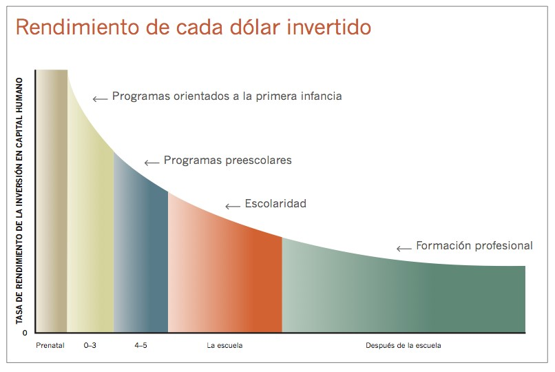  
</div>
.center[[Heckman, J. J. (2006)](https://doi.org/10.1126/science.1128898 )]

---
name: arguments4
### 5 arguments a favor de les polítiques d'infància .left[.pq[4.Cohesió social]]
<div align="center">
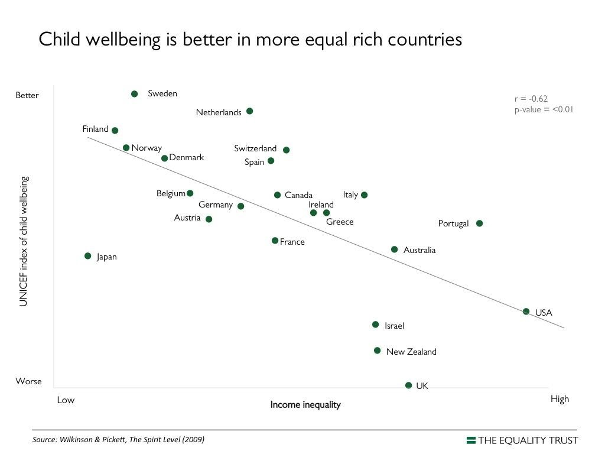  
</div>
.center[[Pickett, K., & Wilkinson, R. (2010)](https://www.turnerlibros.com/libro/desigualdad/)]

---
name: arguments5
### 5 arguments a favor de les polítiques d'infància .left[.pq[5.Trencar el "Cicle de la desigualtat"]]
.pull-left[
<br><br><br><br>
**Transmissió intergeneracional de la pobresa**    

Risc diferencial que tenen les persones que creixen en llars _pobres_ a patir  problemes econòmics (però no sols) durant la seva vida adulta.
]  

.pull-right[
<div align="center">
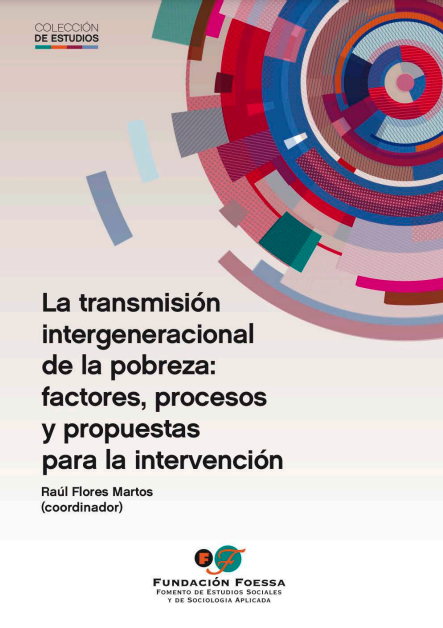  
</div>
.center[[Flores Martos, Raúl (2016)](https://www.observatoriodelainfancia.es/oia/esp/descargar.aspx?id=4912&tipo=documento)]
]
---
name: LDOIA
class: inverse, middle, left
# Context legal de Catalunya
----
### LLEI 14/2010, del 27 de maig, dels drets i les oportunitats en la infància i l'adolescència.
### DECRET 250/2013, de 12 de novembre, de la Taula Nacional i les taules territorials i locals d’infància 
### Ordre BSF/331/2013, de 18 de desembre, per la qual s'aproven les llistes d'indicadors i factors de protecció dels infants i adolescents
---
name: LDOIA1
class: top, left
### [Llei dels drets i les oportunitats en la infància i l'adolescència (LDOIA)](https://portaljuridic.gencat.cat/eli/es-ct/l/2010/05/27/14)
<div align="center">
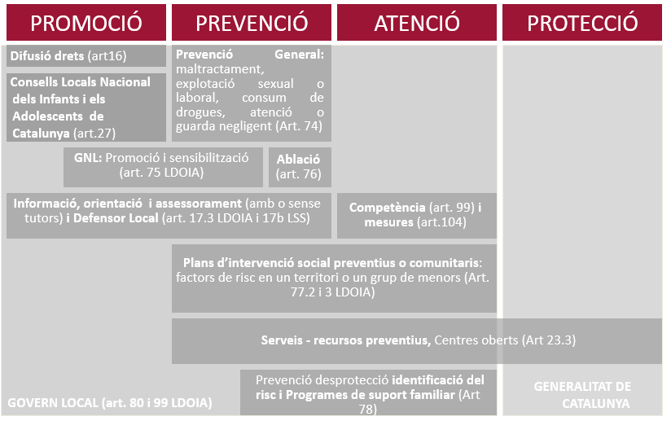  
</div>
---
name: LDOIA2
class: top, left
### [Llei dels drets i les oportunitats en la infància i l'adolescència (LDOIA)](https://portaljuridic.gencat.cat/eli/es-ct/l/2010/05/27/14)
<div align="center">
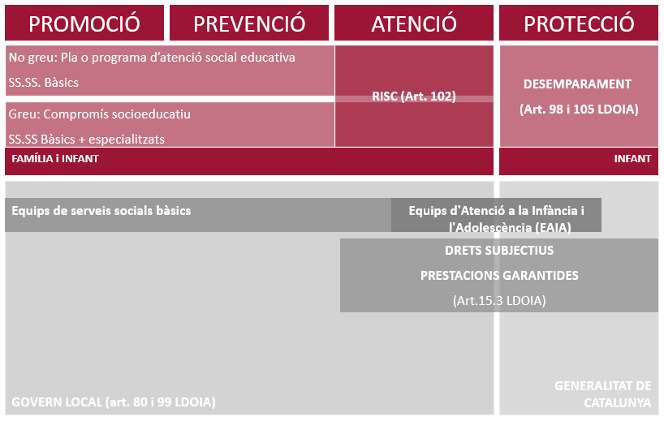  
</div>
---
name: LDOIA3
class: top, left
### [Llei dels drets i les oportunitats en la infància i l'adolescència (LDOIA)](https://portaljuridic.gencat.cat/eli/es-ct/l/2010/05/27/14)
<div align="center">
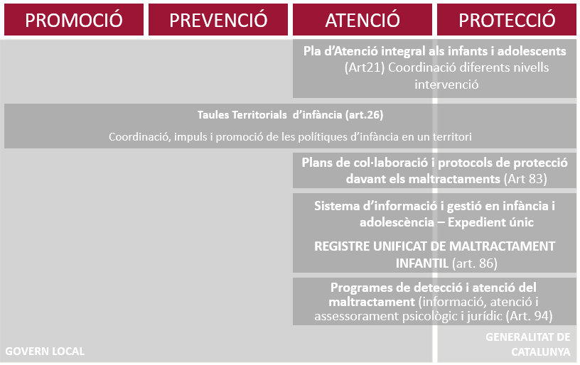  
</div>

---
name: LDOIA4
class: top, left
### [DECRET 250/2013, de 12 de novembre, de la Taula Nacional i les taules territorials i locals d’infància ](https://portaljuridic.gencat.cat/eli/es-ct/d/2013/11/12/250)
----
* **Dispersió de les polítiques** dirigides a la infància entres diversos àmbits (educatiu, social, sanitari,.. ) i diverses administracions (Estatal, Generalitat, ens locals) 
> Coordinar els diferents equips, serveis i agents implicats del territori per potenciar el treball en xarxa, en especial en els àmbits de l’educació, la salut, la seguretat, el treball, la joventut i les dones, que afecten la infància i l’adolescència del territori, i millorar els programes de participació, prevenció, promoció, detecció i protecció de la infància i l’adolescència
* Les coordinacions, el treball en xarxa o la cocreació de polítiques (segon el grau d’integració de les accions) no són per tant, un objectiu en si mateix, sinó que responen a una **lògica de millora de l’eficiència de la gestió** i de **millora de l’impacte de les polítiques**

* Importància del **factor territorial**.

---
name: LDOIA5
class: top, left
### Ordre BSF/331/2013, de 18 de desembre, per la qual s'aproven les llistes d'indicadors i factors de protecció dels infants i adolescents
**Indicadors de situacions de risc i desemparament**  
<div align="center">
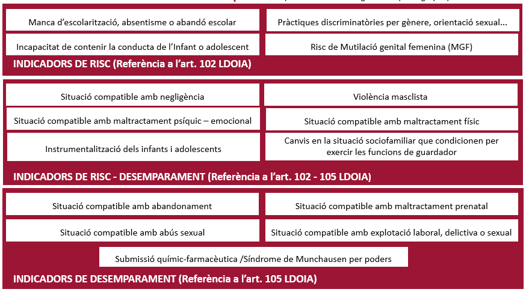  
</div>
---
name: LDOIA6
class: top, left
### Ordre BSF/331/2013 - **.pq[Factors de risc i de protecció]**
.pull-left[
**Característiques personals de l’infant o l’adolescent**  
- Estat físic i/o desenvolupament evolutiu de l’infant o l’adolescent. 
- Estat psicològic de l’infant o l’adolescent.

**Característiques comportamentals de l’infant o l’adolescent.**
- Antecedents de maltractament infantil en l’infant o l’adolescent.

**Característiques personals dels pares, tutors o guardadors**
-Estat físic/ psicològic dels p,t,g.  
- Toxicomanies i/o addiccions dels p,t,g.  
- Conducta violenta, antisocial, delictiva i/o de risc dels p,t,g.]

.push-right[
**Estudis o formació i habilitats dels pares, tutors o guardadors** 
- Estudis i/o formació dels p,t,g.  
- Habilitats socials dels p,t,g.  

**Antecedents dels pares, tutors o guardadors**  
- Hª personal de maltractaments i/o abandonament infantil en els p,t,g.
- Hª de conducta violenta, antisocial i/o delictiva dels p,t,g.  

**Característiques familiars**  
- Composició i estructura de la família.  
- Dinàmica familiar.  
- Situacions i esdeveniments familiars estressants.  
- Antecedents de violència en la família.
]
<style>
.left {
  width: 50%;
  text-align: left;
}

.punt{
  font-size: 1em;
  color: #992A38;
  font-weight: bold;
}
</style>
<div class="left">
  <p class="punt">
  <b>Característiques de la comunitat</b>
  <ul>
    <li>Escola i context escolar.</li>
    <li>Barri i context comunitari.</li>
    <li>Disponibilitat i/o accessibilitat als serveis de suport</li>
    </p>
</div>
</div>
---
name: LDOIA7
class: top, left
### Ordre BSF/331/2013 - **.pq[Factors de pronòstic]**
* Consciència de problema en els progenitors, tutors o guardadors.  
* Motivació per al canvi en els progenitors, tutors o guardadors.  
* Consciència de necessitar ajuda d'un tercer professional, en els progenitors, tutors o guardadors.  
* Possibilitats d'establir un context de treball de col·laboració dels progenitors, tutors o guardadors amb els professionals.  
* Cronicitat de la problemàtica familiar.  
* Gravetat del maltractament infantil.  
* Gravetat dels efectes i les conseqüències del maltractament en l’infant o l’adolescent.  
* Disponibilitat dels serveis necessaris.  
* Intervenció d'altres serveis amb la família.  
* Obtenció de resultats en el procés de suport i/o tractament a la família.  
* Temporalitat en la recuperació de les funcions familiars i capacitats parentals.  
* Important incidència dels factors de risc en les funcions familiars i capacitats parentals.  
* Important incidència dels factors de protecció en les funcions familiars i capacitats parentals  
--
  
  **INSTRUMENTS DE CRIBRATGE**
* [Simulador del Mòdul de Suport a la Gestió del Risc](https://dps.gencat.cat/rumi/#/simulacio/inici-simulacio)  
Eina per a professionals aliens als serveis socials que els permet orientar la intervenció en cas de sospita de maltracte o abús a infants o adolescents.

* [Eina de cribatge de situacions de risc i desemparament](https://dretssocials.gencat.cat/web/.content/03ambits_tematics/07infanciaiadolescencia/recursos_professionals/pdf/eina_cribratge.pdf)  
Algoritme que orienta l'exploració i la derivació de les professionals dels Serveis socials de primària i dels especialitzats.

---
name: intervencio
class: top
# El procés d'intervenció social
----
<br><br>
<div align="center">
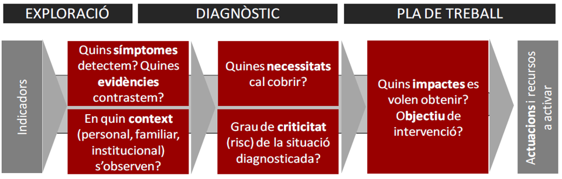  
</div>
---
name: vida
class: inverse, top, left
# PART III: Els suport de la Unitat del Cicle de Vida]
.pull-left[

.tomato5.bg-white[[ - Plans d'Infància i adolescència](#PLIAS)]  

.tomato5.bg-white[[- Finançament per a la promoció i prevenció en l’àmbit de la infància i l’adolescència](#finançament)]  

.tomato5.bg-white[[- Espais de capacitació tècnica: grups de reflexió en parentalitat positiva](#parentalitat)]

.tomato5.bg-white[[- Subvencions a favor d'entitats sense finalitat de lucre](https://www.diba.cat/web/igualtat-ciutadania/subvencions-a-entitats-2023#convocatoria)]  

.tomato5.bg-white[[- Mesurament de la inversió pressupostària en la infància i l'adolescència](#altres)]
]

.pull-right[
<div align="right">
  
</div>
]
---
name: PLIAS
class: top, left, 
### Eines per a la planificació de les polítiques d'infància i adolescència  

**Suport tècnic** per a la planificació estratègica en l'àmbit de la infància i l'adolescència. La finalitat del recurs és estructurar de manera global l'acció pública local, i els programes d'actuació que se'n deriven, des dels àmbits de la promoció, la prevenció i l'atenció, per tal de garantir el desenvolupament integral d'aquest col·lectiu.

El suport tècnic es concreta en les següents actuacions:  

- Diagnosi del pla local d'infància i adolescència: anàlisi sociodemogràfica basada en evidències i diagnosi participada de la infància i l'adolescència del territori.  

- Disseny del pla d'acció local d'infància i adolescència: definició de les línies estratègiques, disseny de les accions a implementar i identificació del sistema d'indicadors per a fer-ne el seguiment i l'avaluació.  

- Suport específic a la planificació de polítiques d'infància per a municipis menors de 10.000 habitants.  
---
name: parentalitat
class: top, left, 
### Espais de capacitació tècnica: grups de reflexió en parentalitat positiva
* Ajudar i acompanyar als equips professionals a iniciar-se en experiències primerenques en conducció de grups de reflexió -des d’un enfocament relacional i vincular- per a pares i mares, i fer-ho amb una base de seguretat i d’eficàcia, dins d’un context grupal d’iguals.  
* Espai de capacitació tècnica:  
    * Sensibilitzar en la importància de promocionar bones pràctiques parentals dins del marc del treball en xarxa.  
    * Prendre consciència de la posició del conductor/a i del co-conductor/a d’un grup de pares i mares. 
    * Connectar amb les emocions i els pensaments que s'activen a les persones dins d’un grup.  
    * Compartir tècniques i eines, i enfortir certes capacitats, com a elements facilitadors de canvis en el treball amb grups de pares i mares. 
    * Conèixer un ventall d’experiències municipals en l’àmbit del treball grupal amb pares i mares. 
    * Avaluar el treball grupal amb pares i mares.  
    
* Espai de reflexió i acompanyament a la pràctica grupal:
    * Millorar les pràctiques professionals.
    * Sentir-se acompanyats i continguts en un entorn confidencial i segur.   
    * Compartir i celebrar junts els seus “primers passos”’ i els seus èxits.
    * Crear un llenguatge comú.  
    * Afrontar amb més seguretat les situacions posteriors.  
    
---
name: finançament
class: top, left, 
### Finançament per a la promoció i prevenció en l'àmbit de la infància i l'adolescència  

**Suport econòmic** a les actuacions dels ens locals en els àmbits de la promoció i prevenció en la infància i l'adolescència. Es donarà suport a programes i actuacions que vagin encaminades a:  
- Difondre i promoure els drets dels infants.  
- Fomentar la participació infantil i adolescent com a mecanisme per garantir l'exercici dels seus drets.  
- Promoure una ciutat habitable per a la infància i l'adolescència: la promoció d'entorns segurs, la mobilitat activa, la promoció de l'autonomia, els espais verds, i les ciutats lliures de contaminació i residus, entre d'altres.  
- Garantir un accés equitatiu als serveis i recursos locals per part dels infants i les seves famílies.  
- Fomentar el lleure i l'oci dels infants i les seves famílies amb criteris d'igualtat (o equitat) i inclusió.  
- Acompanyar la criança: projectes d'acompanyament socioemocional o psicològic, de criança positiva, de lluita contra la bretxa digital, o de cobertura de necessitats bàsiques, entre d'altres.   
- Lluitar contra qualsevol tipus de discriminació, ja sigui per diversitat cultural, d'origen, racial, gènere, afectiva, sexual o funcional.   

--
### [Fons extraordinari benestar emocional d’infants i adolescents](https://www.diba.cat/es/web/sala-de-premsa/-/la-diputaci%C3%B3-de-barcelona-impulsa-un-fons-extraordinari-de-5-9-m-%E2%82%AC-per-fer-front-a-l-emerg%C3%A8ncia-d-atenci%C3%B3-social-i-benestar-emocional-d-infants-i-adolescents-derivada-de-la-pand%C3%A8mia)
Fons de de 5,9 M € és que els ens locals per programes de prevenció, prestar serveis i dur a terme activitats de promoció del benestar i la salut emocional adreçats a població infantil i adolescent i llurs famílies, la situació dels quals s’ha vist agreujada per la pandèmia provocada per la Covid-19

---
name: altres
class: top, left, 
### Subvencions a favor d'entitats sense finalitat de lucre

Suport econòmic a les entitats que promouen la garantia de drets en la infànci i l'adolescència que tinguin per àmbit territorial d'intervenció la província de Barcelona [+](https://www.diba.cat/web/igualtat-ciutadania/subvencions-a-entitats-2023#convocatoria)

### Mesurament de la inversió pressupostària en la infància i l'adolescència
> El mesurament i la identificació de la despesa pública
destinada a la infància en els pressupostos que proposa
aquesta metodologia, té un valor en si mateix per conèixer
les xifres generals (i per sectors) i millorar la seva traçabilitat, seguiment i monitoratge, per identificar increments
o disminucions de les partides rellevants per a la infància
i analitzar la major o menor orientació del pressupost cap
als infants    

[UNICEF (2018)](https://economia.gencat.cat/web/.content/70_pressupostos/jornada-unicef/metodologia-mesurament-inversio.pdf)
---
name: Thks
class: inverse, middle, center, hide-logo
# Moltes gràcies!
----
### Per qualsevol suggeriment, dubte:
  
<br>
<b>·</b> 
[`r fontawesome::fa("envelope", a11y = "sem", fill = "#FFFFFF")` ](mailto:mayordomome@diba.cat)<b>·</b> 
[`r fontawesome::fa("laptop", a11y = "sem", fill = "#FFFFFF")` ](https://eloimm.github.io/)<b>·</b> 
[`r fontawesome::fa("twitter", a11y = "sem", fill = "#FFFFFF")` ](https://twitter.com/eloimm) <b>·</b>
[`r fontawesome::fa("mastodon", a11y = "sem", fill = "#FFFFFF")` ](mastodont.cat/@eloimm) <b>·</b>


???

---
name: biblio
class: middle, inverse
# .center[Bibliografía]
* * *

---
name: biblio1
# Bibliografia
-----

* Cantillon, B. (2011). The paradox of the social investment state: growth, employment and poverty in the Lisbon era. Journal of European Social Policy, 21(5), 432-449. https://doi.org/10.1177/0958928711418856  
* Center on the Developing Child at Harvard University. (s.f.). Serve & Return Interaction Shapes Brain Circuitry. Recuperado de https://www.youtube.com/watch?v=m_5u8-QSh6A  
* Domínguez-Serrano, M., & del Moral Espín, L. (2016). Bienestar en la infancia. Indicadores desde un enfoque de capacidades y de sostenibilidad de la vida. Presentado en Bienestar en la infancia. Indicadores desde un enfoque de capacidades y de sostenibilidad de la vida, XV Jornadas de Economía Crítica, Madrid.  
* Elango, S., García, J. L., Heckman, J., & Hojman, A. (2016, enero 12). Early childhood education and social mobility. Recuperado 19 de diciembre de 2016, de http://voxeu.org/article/early-childhood-education-and-social-mobility   
* Escribà-Agüir, V., & Fons-Martinez, J. (2014). Crisis económica y condiciones de empleo: diferencias de género y respuesta de las políticas sociales de empleo. Informe SESPAS 2014. Gaceta Sanitaria, 28, 37-43. https://doi.org/10.1016/j.gaceta.2014.01.013  
* European Commission. (2013). Invertir en la infancia: romper el ciclo de las desventajas. Diario Oficial de la Unión Europea. Recuperado de http://eur-lex.europa.eu/legal-content/ES/TXT/HTML/?uri=CELEX:32013H0112&from=EN

---
name: biblio2
# Bibliografia
-----
*  European Commission. (2016, junio 10). A New Skills Agenda for Europe Working together to strengthen human capital, employability and competitiveness. Recuperado de https://eur-lex.europa.eu/legal-content/EN/TXT/PDF/?uri=CELEX:52018SC0067&from=EN  
*  European Council. (2002). Presidency Conclusions. Barcelona European Council, 15 and 16 march 2002. Recuperado de http://ec.europa.eu/invest-in-research/pdf/download_en/barcelona_european_council.pdf  
* Flores Martos, R., Gomez Morán, M., & Renes Ayala, V. (2016). La transmisión intergeneracional de la pobreza: factores, procesos y propuestas para la intervención (Fundación FOESSA). Fundación FOESSA. Recuperado de http://www.caritas.es/imagesrepository/CapitulosPublicaciones/5250/transmisi%C3%B3n%20intergeneracional%20pobreza.pdf  
* Foster, J., & Handy, C. (2008). External Capabilities (OPHI Working Papers No. ophiwp008). Queen Elizabeth House, University of Oxford. Recuperado de https://ideas.repec.org/p/qeh/ophiwp/ophiwp008.html  
* Fraser, N. (2014). Justice Interruptus: Critical Reflections on the «Postsocialist» Condition. Routledge.  
* García, A. M. (2010). Mercado laboral y salud. Informe SESPAS 2010. Gaceta Sanitaria, 24, 62-67. https://doi.org/10.1016/j.gaceta.2010.07.002  

---
name: biblio3
# Bibliografia
-----
* Ghysels, J., & Van Lancker, W. (2011). The unequal benefits of activation: an analysis of the social distribution of family policy among families with young children. Journal of European Social Policy, 21(5), 472-485. https://doi.org/10.1177/0958928711418853  
* Heckman, J. J. (2006). Skill Formation and the Economics of Investing in Disadvantaged Children. Science, 312(5782), 1900-1902. https://doi.org/10.1126/science.1128898  
* Heckman, James J., & Masterov, D. V. (2007). The Productivity Argument for Investing in Young Children (Working Paper No. 13016). National Bureau of Economic Research. Recuperado de http://www.nber.org/papers/w13016  
* Iversen, T., & Wren, A. (1998). Equality, Employment, and Budgetary Restraint: The Trilemma of the Service Economy. World Politics, 50(4), 507-546. https://doi.org/10.1017/S0043887100007358  
* Korpi, W., & Palme, J. (1998). The Paradox of Redistribution and Strategies of Equality: Welfare State Institutions, Inequality, and Poverty in the Western Countries. American Sociological Review, 63(5), 661-687. https://doi.org/10.2307/2657333  
* Mari-Klose, P., & Marí-Klose, M. (2015). Pobresa infantil i preredistribució. En Mesures predistributives per garantir una major igualtat des de la infància. Programa «La predistribució: repensar les polítiques socials» (pp. 6-44). Recuperado de http://www.catdem.org/cat/downloads2/politiques-predistributives-per-al-primer-cicle-vital-0-18-anys-.-final.pdf  

---
name: biblio4
# Bibliografia
-----
* Mayordomo Martínez, E., & Millán Cañamares, X. (2017). Avances, límites y retos en la garantía de derechos de la infancia en Cataluña. Una aproximación desde el ámbito municipal. ZERBITZUAN, (63), 75-88. https://doi.org/10.5569/1134-7147.63.04   
* Moreno, L., & Serrano Pascual, A. (2007). Europeización del Bienestar y activación. Política y Sociedad, 44(2), 31-44.  
* Noguera, J. A. (2016, diciembre 11). Socialdemocracia y redistribución: la dura realidad. Recuperado 11 de enero de 2017, de http://agendapublica.es/socialdemocracia-y-redistribucion-la-dura-realidad/  
* Nussbaum, M., & Sen, A. (Eds.). (1993). The Quality of Life. Oxford University Press.  
* Pickett, K., & Wilkinson, R. (2010). The Spirit Level: Why Equality is Better for Everyone. Penguin.  
* Prats, J. V. R., & Colomer, A. R. (2002). Los Servicios Sociales Municipales y la intervención con el menor. El papel de los Ayuntamientos en las políticas de infancia. Informació psicologica, 0(78), 21-29.   
* Roche, J. (1999). Children: Rights, Participation and Citizenship. Childhood, 6(4), 475-493. https://doi.org/10.1177/0907568299006004006  

---
name: biblio5
# Bibliografia
-----
* Trani, J.-F., Bakhshi, P., Bellanca, N., Biggeri, M., & Marchetta, F. (2011). Disabilities through the Capability Approach lens: Implications for public policies. ALTER - European Journal of Disability Research / Revue Européenne de Recherche sur le Handicap, 5(3), 143-157. https://doi.org/10.1016/j.alter.2011.04.001  
* Vandenbroucke, F., & Vleminckx, K. (2011). Disappointing poverty trends: is the social investment state to blame? Journal of European Social Policy, 21(5), 450-471. https://doi.org/10.1177/0958928711418857  
* White, S. C. (2002). From the politics of poverty to the politics of identity? Child rights and working children in Bangladesh. Journal of International Development, 14(6), 725-735. https://doi.org/10.1002/jid.919  

```{r eval=FALSE}
# renderthis::to_pdf("Udl.Rmd")
usethis::use_git()
usethis::use_github()
```

